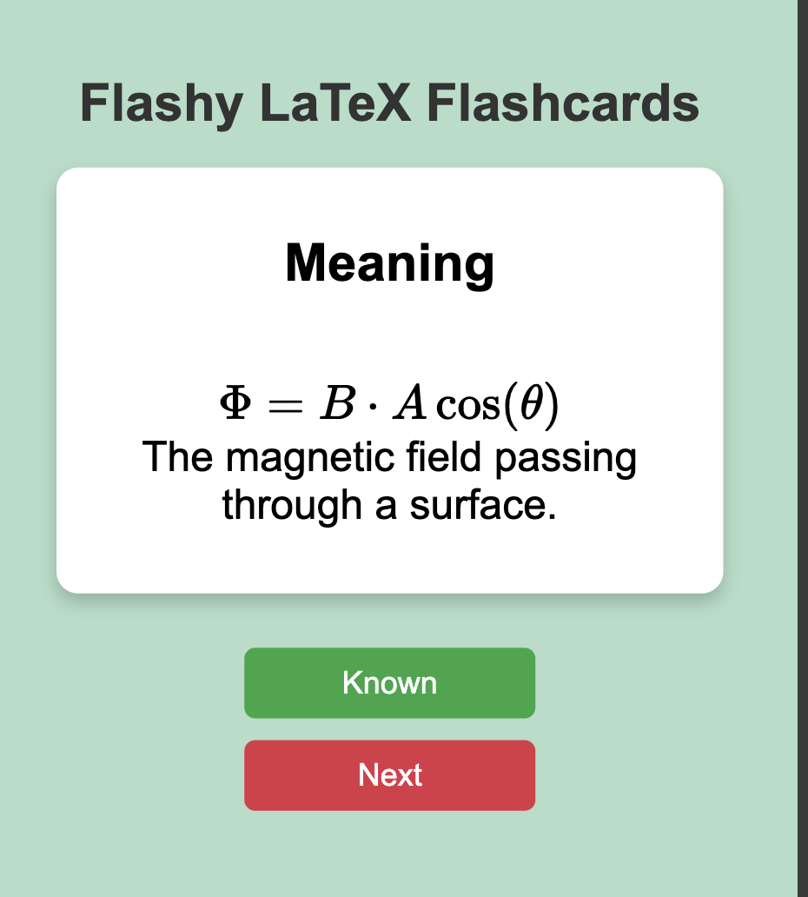

# 🌟 **Physics Formulas Cheat Sheet** 🌟  
[](https://raimonvibe.github.io/physics_formulas/)  



## 🚀 **About the Project**  
A quick-reference guide with essential physics formulas for students, engineers, and enthusiasts. Simplify your physics calculations with neatly structured definitions and equations!

---

## 📚 **Table of Contents**  
- [Features](#features)  
- [Live Page](#live-page)  
- [Installation](#installation)  
- [Usage](#usage)  
- [Contributing](#contributing)  
- [License](#license)  

---

## ✨ **Features**  
✅ Comprehensive set of essential physics formulas  
✅ Categorized for easy access  
✅ LaTeX-powered equations for clarity  
✅ Suitable for physics students and professionals  

---

## 🌐 **Live Page**  
Access the project [here](https://raimonvibe.github.io/physics_formulas/) and dive into the world of physics equations.  

---

## 🛠️ **Installation**  
Clone the repository and run it locally:  

```bash
git clone https://github.com/raimonvibe/physics_formulas.git
cd physics_formulas
```

---

 ## 🚀 **Usage**  
To start a local development server using Python, run the following command:  

```bash
python -m http.server
```
---

## 🤝 **Contributing**  
We welcome contributions to improve and expand this cheat sheet!  
1. Fork the project  
2. Create a new branch (`git checkout -b feature/AmazingFeature`)  
3. Commit your changes (`git commit -m 'Add some AmazingFeature'`)  
4. Push to the branch (`git push origin feature/AmazingFeature`)  
5. Open a Pull Request  

---

## 📝 **License**  
Distributed under the MIT License. See `LICENSE` for more information.  

---

### 💬 **Have Questions or Suggestions?**  
Feel free to reach out by opening an issue in the repository.  

---

Enjoy physics! 🌍✨
